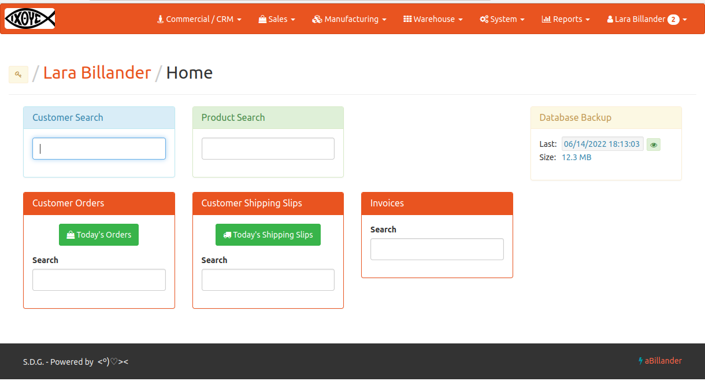

## ab://ander/Project

**aBillander** is an Invoicing and Inventory System integrated with WooCommerce, intended for SME's and powered by  <º)♡><  and  Laravel.

## ab://ander/Features

> Sales and Receivables.

> Purchases and Payables.

> Inventory

> Customer Center (B2B)

> WooCommerce Connector (B2C)

> Sales Representative Center

> Manufacturing

> Lots and Traceability

> microCRM

Check out our [YouTube Channel](https://www.youtube.com/channel/UCTv7x_i1qiBWZkQsrE8Y6vA/videos) .

## ab://ander/Status

> Production ready: three Companies have used aBillander for more than 2 years now.

> More implementations needed (main goal for year 2022).

> Contributors are welcome.

## ab://ander/Branches

> Use branch *master* with Laravel 9.x.

> Branch *ninette* is intended for development.

> Use branch *service* with Laravel 5.5 (not supported anymore).

## ab://ander/Roadmap/Milestones

> SDG0: **MVP done** (2021/1). aBillander initial version. Production ready.

> SDG1: **POS integration** (in progress). Should be running live by the end of 2022 in One Customer (at least).

> SDG2: **Better Documentation** (in progress).

> SDG3: **Products with Combinations** .

Curated by [**Lara Billander**](https://www.larabillander.com/) .

Soli Deo Gloria - END of LINE

